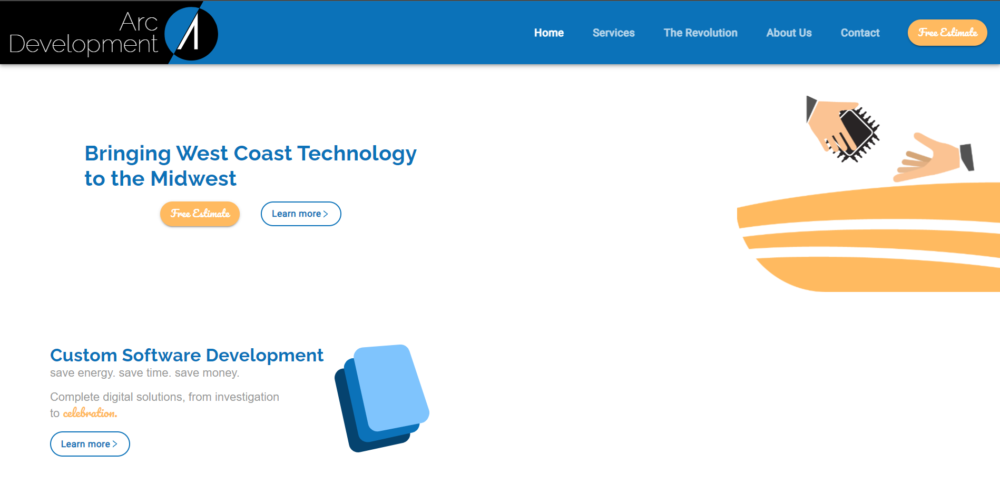
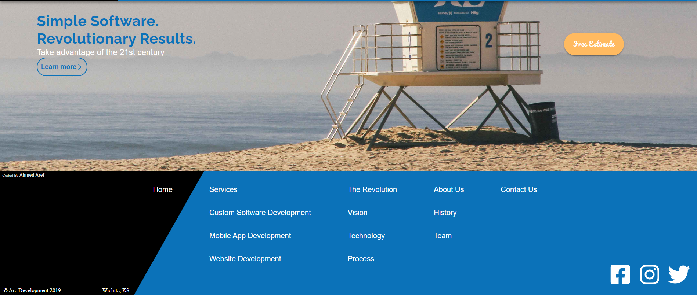
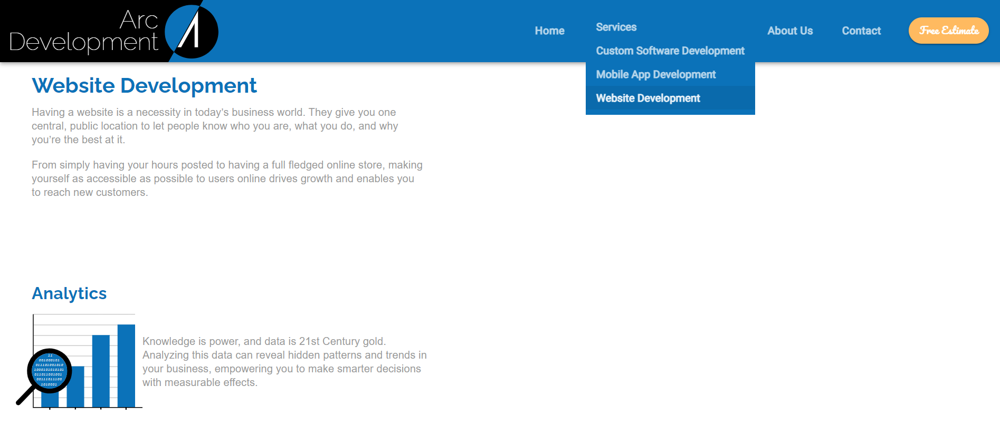
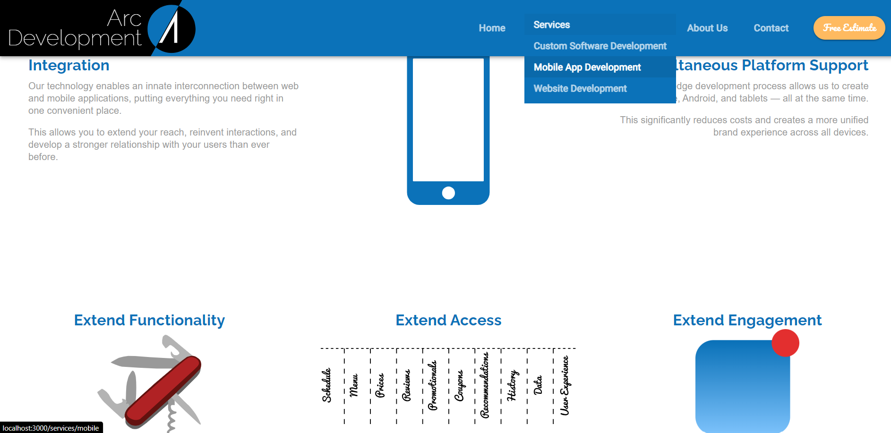
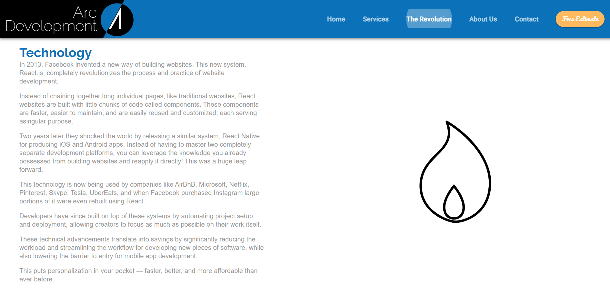
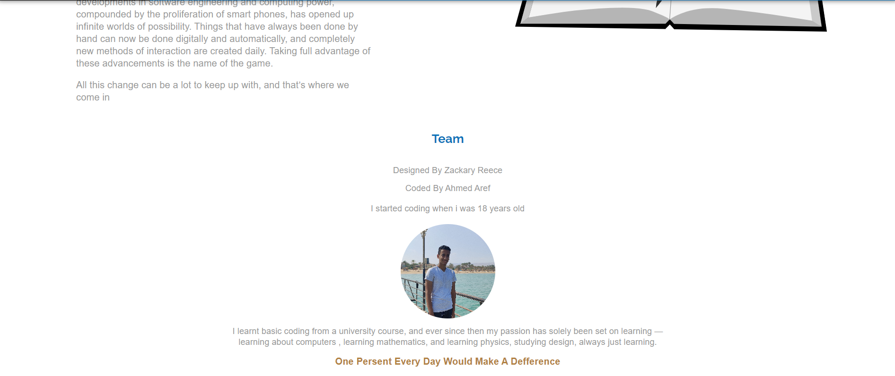
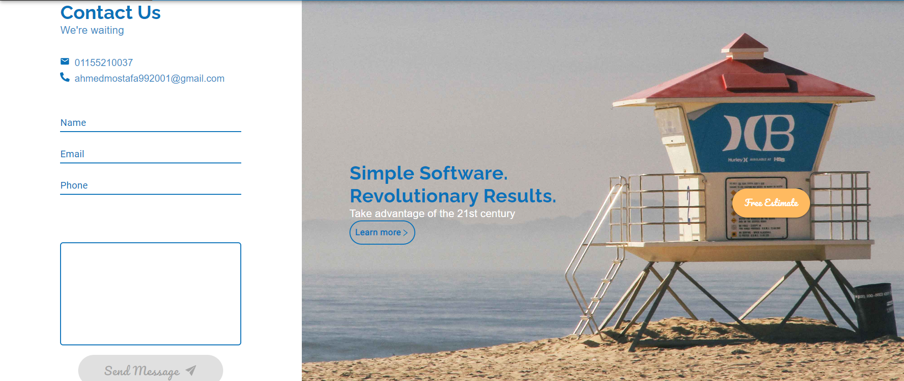
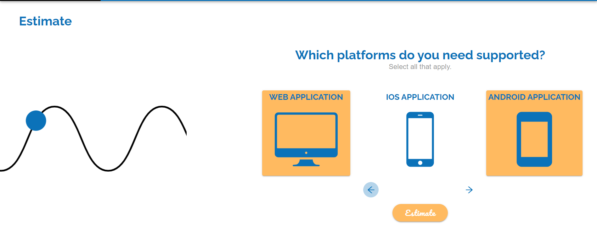
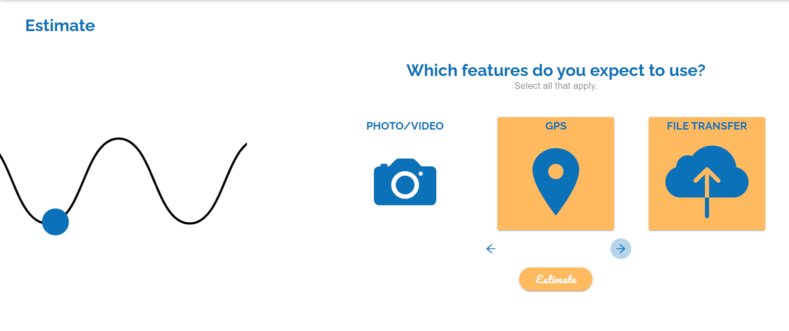
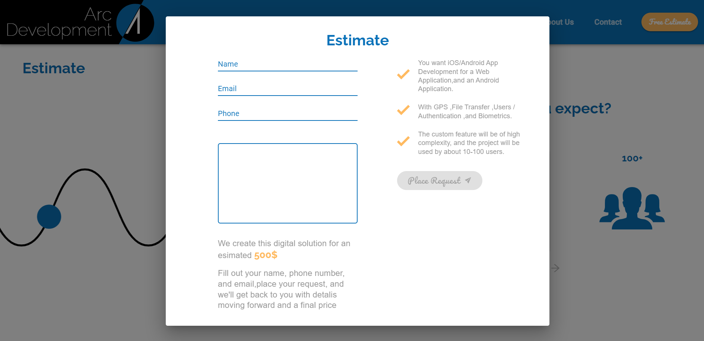

# Arc Development

Arc Development is a frontend application, aimed at delivering high-quality software solutions with a fancy user interface. This application serves as a showcase of various services and interactive features that Arc Development offers to its clients. The app was developed to practice on React.js and Material-UI

## Running the Application

To get the application up and running on your local machine, follow these steps:

1. **Prerequisites**: Ensure Docker is installed on your system.
2. **Clone the Repository**:

   ```bash
   git clone [repository-url]
   ```
3. **Navigate to the Project Directory**:

   ```bash
   cd arc-development
   ```
4. **Launch the Application**:

   ```bash
   docker-compose up
   ```
5. **Access the App**:
   Access the application by navigating to `http://localhost:3000` in your web browser.

## Examples from Pages

### Home





### Services





### The Revolution



### About Us



### Contact Us



### Estimate






